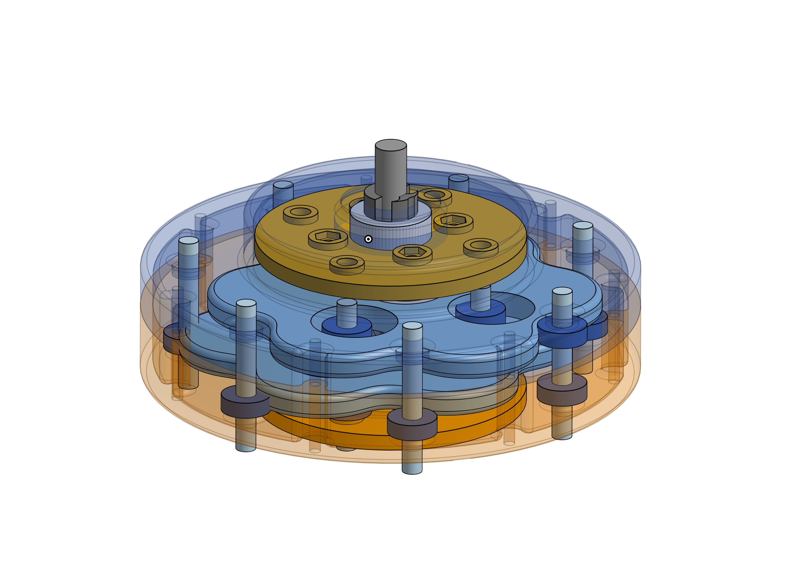

## Introduction

I really wanted to have a gearbox with a high gearing reduction, but I didn't want to buy one, so I decided to make one. 

I chose a cycloidal design. Cycloidal gearboxes are a little bit complex, but they're also incredibly compact for how much gearing reduction they offer. Plus, a difficult project never really deterred me; To Onshape I went!

## Onshape Design

 

### Cycloidal Drive Library

What's awesome about OnShape is that there's tons of public libraries, like the Cycloidal Drive library (https://cad.onshape.com/documents/faff329a4cfe7c7c63da74b1/w/5f3eb2e3185e859ad30398fd/e/eed46c56a4c0a4256d895352), which seriously cut down on the amount of time this project took.

### Bearing and Disk Design

I started by settings the cycloidal disk parameters (number of inner pins, bearing diameter, number of outer pins) and then designed the cams and cases around that. Cycloidal gearboxes function by forcing a disk mounted on an eccentric bearing with n lobes to gradually rotate around the interior of an array of n+1 pins. I chose n = 6, meaning that my design featured 6 lobes and 7 pins. This results in 1 pin elapsed per full rotation of the input shaft, meaning that the gearbox will have a reduction ratio of 7, which isn't as much as some cyc. drives, but is sufficient for this first revision. The pins are actually 1/4" ID ball-bearings mounted on 1/4" bolts. The use of bearings versus bare contact surfaces greatly reduces both lost work as well as wear on the cycloidal disks.

 

### Cam Design

The cams (which offset the cycloidal disks, giving them an eccentric rotation) are designed in pieces so that they can be assembled in and around the large bearings that support the cycloidal disks. It's crazy, but the large bearings are so wide (large ID compared to OD) that multiple machine screws can be fastened within that internal diameter. I'm considering having these cam pieces manufactured out of steel, as I suspect they'll be the primary point of failure, but for now plastic with a high infill is going to be fine.

## Next Steps

The next steps here are actually just fabricating and testing design, which I'll be doing using my Bambu P1P Printer :D Expect the results of that over the next two weeks!!! If you're interested in replicating this design, feel free to contact me via email, which is available on the home-page of this website.