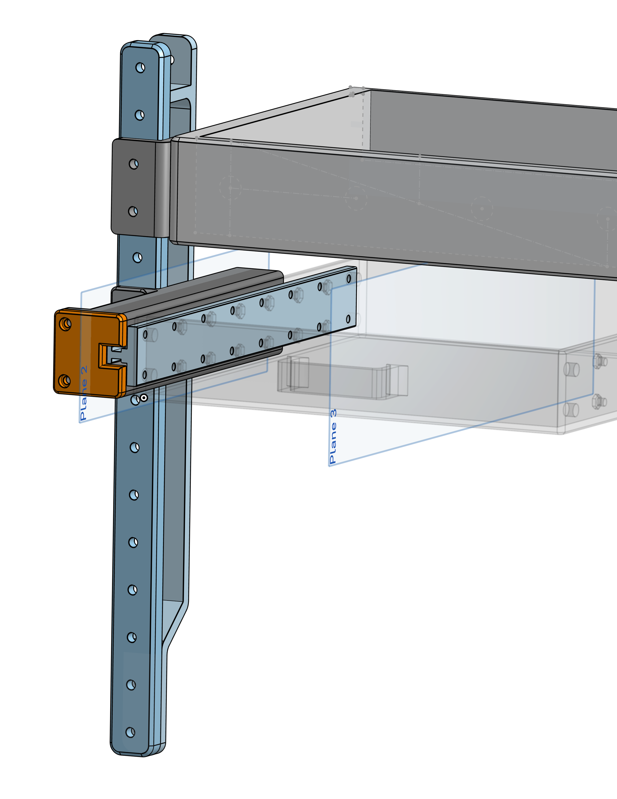
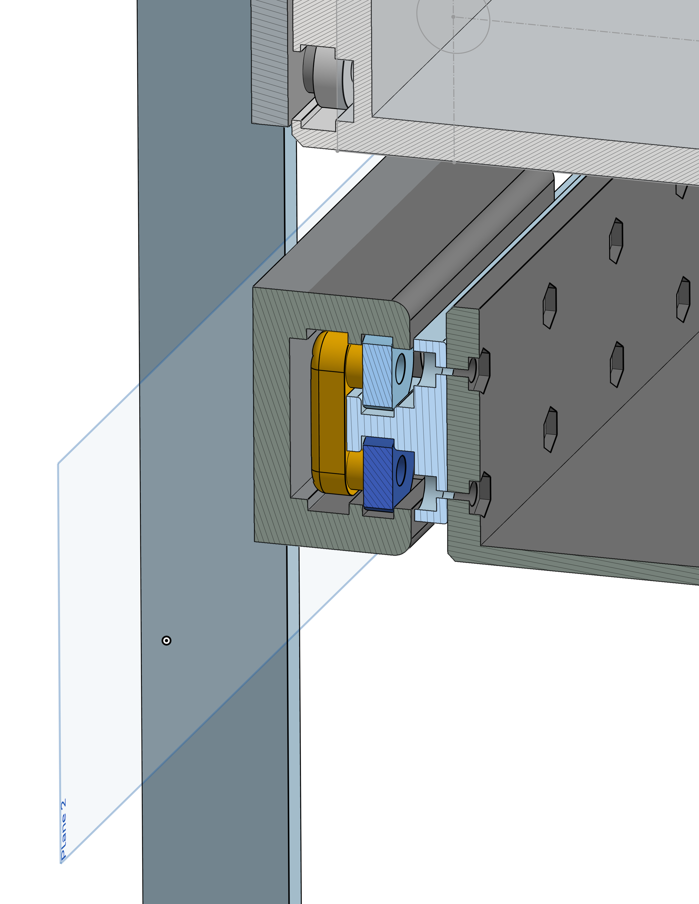
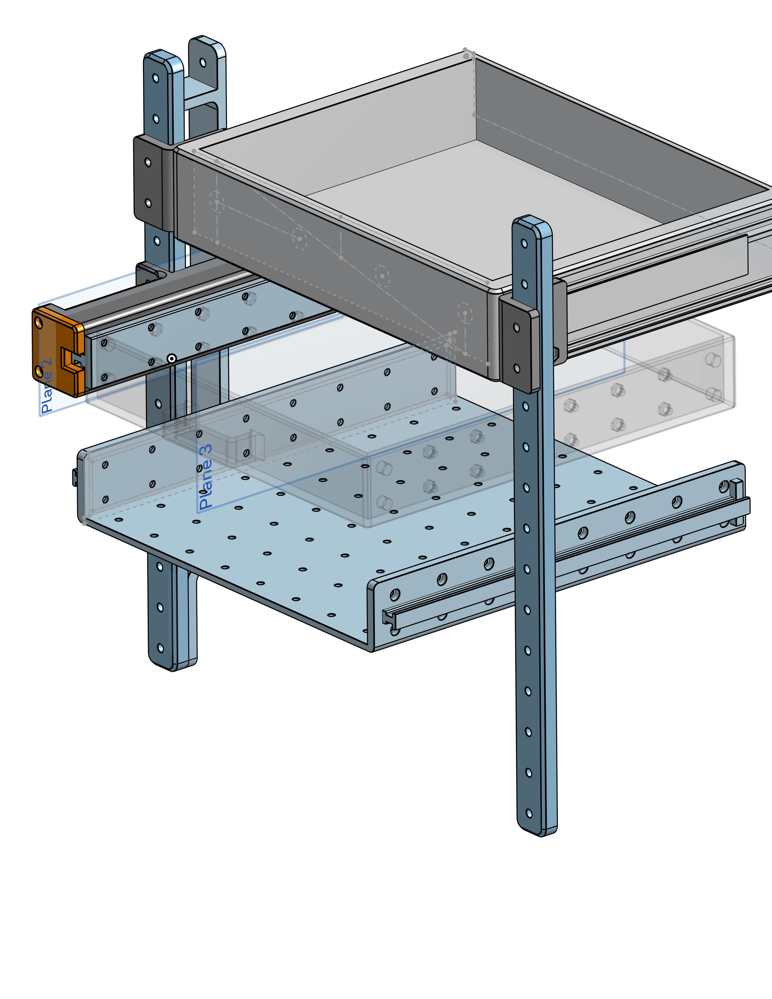

## Introduction

Hello!

This post details the redesign of my drawer project from last time. If you're unfamiliar, it can be viewed under the 'Posts' section of my portfolio.

Last time, our design had the following issues:

- Drawer would droop when fully pushed in.
- The mechanism of drawing the drawer out would sometimes snag on one of the ledges of the drawer.
- Overall lack of robustness.
- Lack of drawer telescoping functionality.

Through the redesign process, we have integrated these faults into a new design which corrects them.

## Part Design

 

In order to address our prior shortcomings, I've reimagined the design to be more robust, and to involve 3 sliding parts. All of the bearings are now on one part, the 'bearing plate'. The rail, which supports the drawer compartment itself, slides on the inner surfaces of these bearings, while the drawer housing slides on the outer surfaces of these bearings. This means that for each unit of distance the drawer travels, the bearing plate will travel half that distance. 

This leads to a telescoping effect, allowing the drawer housing to be half as long as it would otherwise need to be while firmly supporting the drawer rail itself. The result is an action that is much smoother.

 

It should also be noted that the verticle support beams, which were originally 3D printed, have been replaced with two 2020 aluminium T-slot extrusions, which have proven far sturdier, and have eliminated the drooping problem.

The center of mass of the drawers when fully withdrawn has also been adjusted to be in-line with the verticle supports, which reduces drooping very significantly.

## Results

As is apparent in the video below, the new drawer design is vastly superior. The only drawback is that it requires much more assembly, as well as two additional bearings per drawer-slide subassembly, but this is worth it, in my opinion, for the robustness yielded by the more elegant design. However, more economic designs may be pursued in the future.



## Next Steps

For the next steps of this project, I'm going to fabricate and integrate a 'skeleton drawer', which incorporates the rail part, and features a 25 mm x 25 mm grid of M3 holes which fasteners can be screwed into, allowing for the addition of modular compartments to the drawer system.

 

