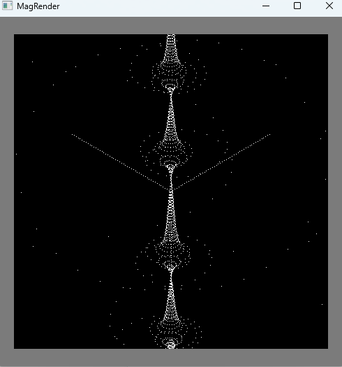

 

# Introduction

I needed a way to do basic visualization of vectors and points in 3D for a few reasons. For one, I'd like to do fractal art for a comic I'm drawing, and for two, I'd like to visualize kinematic models for use in robotics projects, such as my shirt-folding machine project.

## Github

The repository for this project is available here: https://github.com/maggyholzy/magrender

# Program Layout

So basically, this library has a couple of python objects that manage the projection of 3D drawable objects (Currently Points and Lines, inheritting from the Drawable class) onto planes (Cams). This allows for the transfer of a 3D object space [x,y,z] into a 2d space specific to each Cam [x1, y1]. This projection is handled via the on_draw() function contained in all Drawable objects.

## Projection Code

### on_draw(self,cam)
The below function is from the Point class, and is called once per frame


```
def on_draw(self, cam_:Cam):
    try:
        a = cam_.get_plane_coords(self.point)
        # print(a)
        cam_.draw_sprite(self.sprite,a)
    except Exception as e:
        print(f"exception:{e}")
    pass
```

### Cam.get_plane_coords(self,point_)
This is how [x,y,z] space is converted to [x1,y1] space for a given Cam plane. It utilizes the simply derived linear algebra formula for how to project a point onto a plane. 'CNL' is a two-point vector, with the second point being the origin for the plane's coordinate system. 'n' is the normalized one-point-vector.


```
def get_plane_coords(self, point_): 
        
    n = self.cnl[1,:] - self.cnl[0,:] #N2 - N1
    # n = n / np.linalg.norm(self.n) #normalize n, already normalized
    a = -(np.dot(point_, self.n)) + self.cnl[1,:]
    alpha = point_ + a * self.n - self.cnl[1,:] #vector lies on plane, still 3D

    x = np.dot(alpha,self.x1)
    y = np.dot(alpha,self.y1)

    return np.squeeze(np.asarray([y,x]))
```


This function is not yet optimized, and many of these quantities can be cached in the plane itself.


### Cam.draw_sprite(self,sprite:np.ndarray,coordinate)

Finally, once the plane-space coordinates are acquired, the drawable's sprite can be added to the cam's image, which will be printed at the end of each frame. If cam's 'burn-in' property is set to false, then at the start of each frame, the image is wiped, and otherwise, the cam's image is not wiped.

```
def draw_sprite(self,sprite:np.ndarray,coordinate):
    sh = sprite.shape
    ratios = self.window_params[0:2] / self.params[0:2] #ratio of widths and heights
    
    img_coord = np.add(coordinate - self.params[2:]*ratios, self.window_params[2:]) #coordinate of center of sprite in pixel coordinates
    
    img_coord_int = np.array([int(i) for i in img_coord])
    self.image[img_coord_int[0]-sh[0]//2:img_coord_int[0]+sh[0]//2+1:, 
                img_coord_int[1]-sh[1]//2:img_coord_int[1]+sh[1]//2+1:,
                :] = sprite
    pass
```


### Line.on_draw(self, cam_:Cam)

The Line object's on_draw function is similar, but simply interpolates every 'd' distance between its two point coordinates and uses the same dot-sprite rendering to create the appearance of a line.


```
def on_draw(self, cam_:Cam):
        
    #interpolate 
    vec = self.points[1,:] - self.points[0,:]
    vec_len = np.linalg.norm(vec)
    vec = vec / vec_len #normalize
    point = np.copy(self.points[0,:])

    while (np.linalg.norm(point - self.points[0,:]) < vec_len):

        try:
            a = cam_.get_plane_coords(point)
            # print(a)
            cam_.draw_sprite(self.sprite,a)
            

        except Exception as e:
            print(f"exception:{e}")
        point += vec * self.d

    a = cam_.get_plane_coords(self.points[1,:])
    # print(a)
    cam_.draw_sprite(self.sprite,a)

    pass
```

# Results

Along with the on_draw function being called for each drawable each frame, an ndArray callback function is called per each drawable per each frame. Here is the function used to create the helix seen below:
```
def helix(t, p:mg.Point):
    point = np.asarray([0,0,0],dtype=np.float32)
    r = np.abs(4 + 4 * (np.sin( t * 0.24))/(np.cos( t * 0.24)+0.20))
    point[0] = np.cos(t*15) * r
    point[1] = np.sin(t*15) * r
    point[2] = -290 + 12 * t

    point.resize((1,3))

    print(point)

    p.set_point(point)
    return point

helix_t = mg.Point(np.reshape([0,0,0],shape=(1,3)),np.reshape([0,0,0],shape=(1,3)), function=helix, size=1)
mg.drawables.append(helix_t)


x_axis = mg.Line(np.array([0,0,0],dtype=np.float32),np.array([[0,0,0],[200,0,0]],dtype=np.float32),size = 1,d_ = 4)
mg.drawables.append(x_axis)
y_axis = mg.Line(np.array([0,0,0],dtype=np.float32),np.array([[0,0,0],[0,200,0]],dtype=np.float32),size = 1,d_ = 4)
mg.drawables.append(y_axis)
z_axis = mg.Line(np.array([0,0,0],dtype=np.float32),np.array([[0,0,0],[0,0,200]],dtype=np.float32),size = 1,d_ = 4)
mg.drawables.append(z_axis)

```

 

# Next Steps

Next, I'll be using this visualization library to perform kinematics and inverse kinematics analysis useful in robotics. For this, there will need to be a variable table implemented, and a more robust time-series categorization system. More to come!


