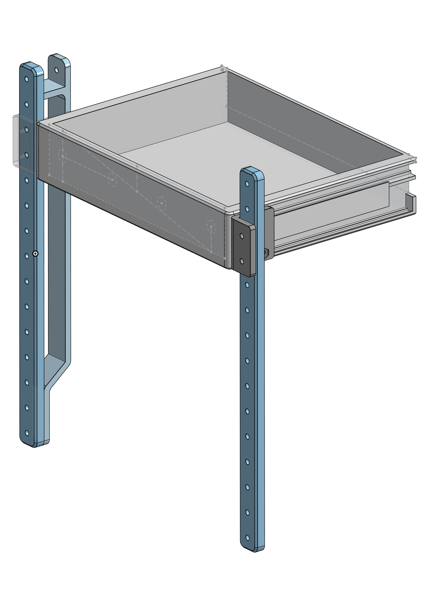
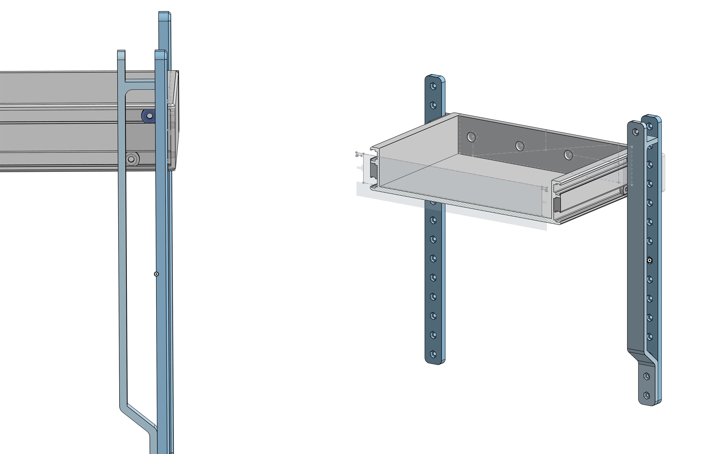
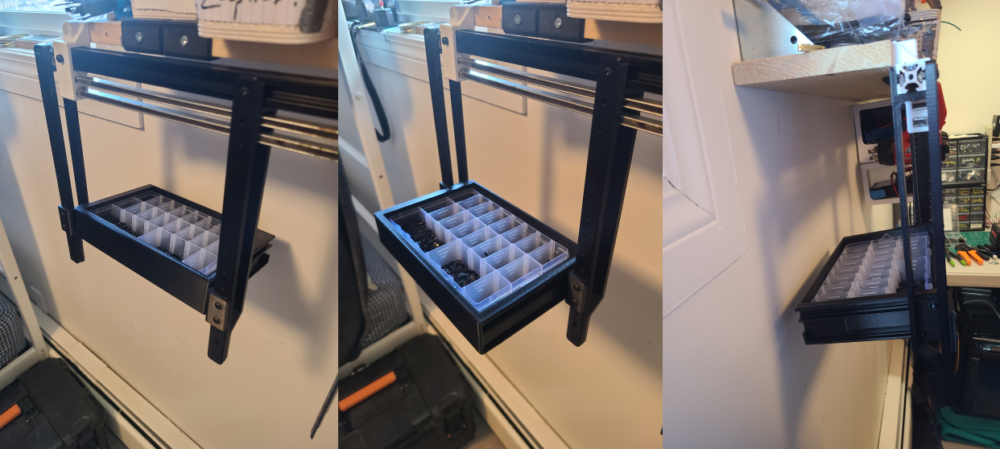

## Introduction

After accidentally spilling a couple boxes of screws, I decided to engineer a solution to that! So I tried my hand at drawer design, with some mixed results.

## Onshape Design

So, the main goal here is to hang an array of shelving from a section of 2020 T-slot, particularly a section of T-slot on some shelving in my apartment. I figured that, since I'm doing this for fun, I'd just approach the challenge without doing too much research on the contemporary design of shelves. The scope is:

- Drawer should have stops so that when fully collapsed or fully extended, its rails does not leave its bearings.
- The drawer's travel should feel firm and reliable. The verticle supports shouldn't feel flimsy.
- The drawer should be easily removed and added back to the verticle supports 

 

### Bearing Design

Here, we can see the two-track design that our drawer uses. As you can see based on the tracks, as long as the drawer remains level, then it's impossible to remove the drawer. However, by extending the drawer fully, and inclining it upwards, it becomes possible to remove the drawer.

One limitation of this design is that it might not be possible to remove/add the drawers while drawers are installed above/below the drawer itself. Since the drawer is designed around the geometry of 2020 T-slot, the drawer itself is 40mm tall, but this might have to be reduced in order to accommodate the addition of multiple drawers in array, per the scope of the project.

## Results

So in terms of the drawer having nice, firm stopping points, we saw succcess! The drawer, indeed, functions as a drawer, and the moment load appears well distributed over the bearings.

However, one shortcoming is that the drawer appears to droop quite substantially when fully withdrawn. This was to be expected, but the effect was more pronounced than expected. Never underestimate how Hooke's constant plummets when dealing with a large assembly, especially one with soft materials like polymers.

The biggest issue here is actually not with the drawers themselves, but rather how the farther back center of mass causes the vertical supports to flex noticeably, and also causes the T-slot to roll somewhat in its supports. This gives the system a flimsy feeling, and makes me hesitate to fill the array out with more drawers. 

## Next Steps

**The solution** here is to add some more depth to our bearing bracket (making it around half the depth of the total drawer) and to make it just a little more complicated, adding another sliding component that withdraws from the bearing bracket, and that the drawer itself can withdraw from. The total number of bearings per bearing bracket will be 4, meaning that the number bearings per drawer will double. However, this will allow for much largers drawers, and allow them to be withdrawn farther, leading to an overall better system.

Another small addition that will improve the functionality of the system is the addition of a 25 mm x 25 mm grid of 4.20 mm holes to the faces of the drawers. This will allow them to double as a pegboard surface, further improving the functionality of my studio.

Stay tuned for more updates, and thank you for reading!