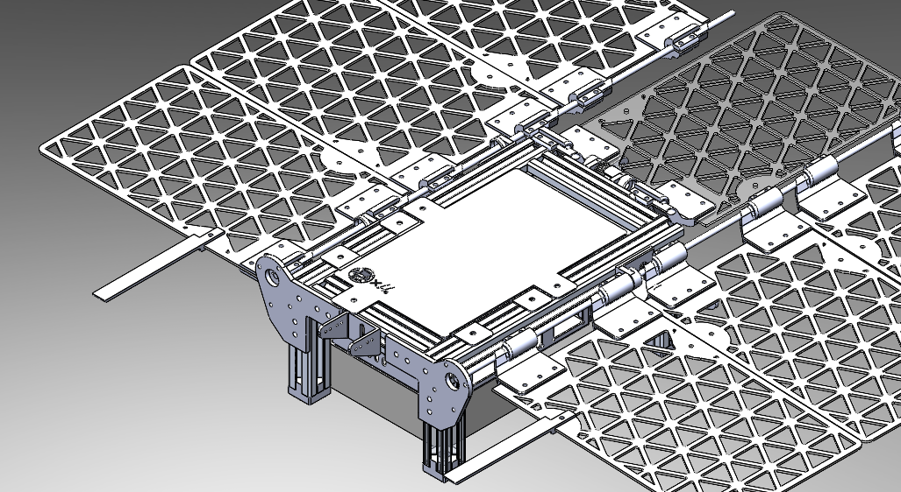
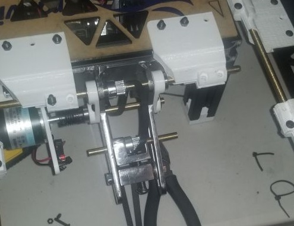

 

# Design

Great news!

Last night, after hours of poring over my device's software, switching between test-versions of firmware and production versions of my firmware, I was able to produce the correct behavior, and, remarkably, produce a folded shirt. This is a big step forward

Deep down, I was expecting another issue to arise with my motor specifications, but instead my math from months ago bore fruit, and the panels accelerated to a speed just tremendous enough to counteract the building forces of gravity threatening to pull the fabric down the pitching panel. Before a person could even identify the absence of any slipping or rolling, a well-folded shirt was on the delivery panel.

It's still surreal to me that it went off without a hitch. Now, instead of fretting over my design, I'm broadening my perspective, looking to ways that I can make the device more reliable, more visually professional, and more readily sold. To put it plainly, I'm proud of what I've accomplished, and I'm glad that I've learned so much. I can't wait to continue even farther with this, and with other projects.

# Tensioner Fabrication



This tensioner is heavy duty. Each piece is quarter inch steel, milled in my university machine shop. It took longer than I'd like to admit to get a handle on all the equipment, but I think the next part will go a lot faster.

Basically, it keeps the belt for the center-panel of my device tight, tight enough that if you push on the center panel, it actually backdrives the crazy AndyMark gearbox I have operating the center panel. Cool, right?

 

